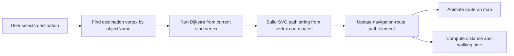

# Seekr Airport Map

Seekr Airport Map is a React and TypeScript indoor navigation demo for an airport-style floor plan. It renders an interactive SVG map, lets the user choose a starting position, and computes the shortest route to shops, services, and facilities on the map.

The project is built around a small graph-based navigation system:

- `vertices` represent walkable points and object anchors on the map
- `edges` connect those points and are weighted by geometric distance
- Dijkstra's algorithm computes the shortest route between the current start point and a destination object
- the resulting path is drawn into the SVG and animated in the UI

## Features

- Interactive indoor map with zoom and pan controls
- Object search with autocomplete
- Click-to-navigate from the sidebar, search, or object modal
- Editable starting position for wayfinding scenarios
- Animated SVG route rendering
- Desktop sidebar layout and mobile route details sheet
- URL-synced start position via the `position` query parameter

## Tech Stack

- React 19
- TypeScript
- Vite
- Tailwind CSS 4
- `react-zoom-pan-pinch` for map interaction
- `react-router-dom` for route/query handling
- `react-toastify` for feedback

## Getting Started

### Prerequisites

- Node.js 20+
- npm

### Install

```bash
npm install
```

### Run locally

```bash
npm run dev
```

Open the local Vite URL shown in the terminal.

### Production build

```bash
npm run build
```

### Preview the production build

```bash
npm run preview
```

## Available Scripts

- `npm run dev` starts the development server
- `npm run build` runs TypeScript project builds and creates a production bundle
- `npm run lint` runs ESLint
- `npm run preview` serves the production bundle locally

## How The Navigation System Works

### 1. Navigation state is created in the map page

The main navigation state lives in `NavigationContext` and is initialized in [src/pages/Map.tsx](/Users/kousikambani/Development/ReactProjects/seekr-airport-map/src/pages/Map.tsx). It stores:

- `start`: the active vertex id, defaulting to `v35` or the `position` query parameter
- `end`: the currently selected destination object name
- `isEditMode`: whether the user is currently choosing a new starting point

The map page also exposes `MapDataContext`, which provides the list of objects and categories loaded from the bundled JSON dataset.

### 2. The graph is built from static map data

The graph definition lives in [src/store/graphData.ts](/Users/kousikambani/Development/ReactProjects/seekr-airport-map/src/store/graphData.ts). It contains:

- `vertices`: points with SVG coordinates and an optional `objectName`
- `edges`: connections between vertex ids

In [src/algorithms/dijkstra.ts](/Users/kousikambani/Development/ReactProjects/seekr-airport-map/src/algorithms/dijkstra.ts), the app:

- creates an adjacency list
- adds each vertex to the graph
- converts each edge into a weighted connection
- uses Euclidean distance between vertex coordinates as the weight

This means route selection is based on the actual geometry of the map, not a fixed number of hops.

### 3. A destination object is mapped to a graph vertex

When a user picks a destination, [src/utils/navigationHelper.ts](/Users/kousikambani/Development/ReactProjects/seekr-airport-map/src/utils/navigationHelper.ts) resolves the destination by finding the vertex whose `objectName` matches the selected object name.

That creates a bridge between UI objects such as `Nike`, `KFC`, or `Entrance` and the walkable graph used for routing.

### 4. The shortest path is calculated

`navigateToObject(...)` calls `graph.calculateShortestPath(start, target.id)`.

If a path is found, the returned list of vertex ids is converted into SVG path commands. The app then updates the special SVG path element with id `navigation-route`, which is rendered in [src/components/IndoorMap/Paths.tsx](/Users/kousikambani/Development/ReactProjects/seekr-airport-map/src/components/IndoorMap/Paths.tsx).

### 5. The route is animated in the map

The route is drawn by setting the `d` attribute of the `navigation-route` SVG path. CSS classes in [src/index.css](/Users/kousikambani/Development/ReactProjects/seekr-airport-map/src/index.css) animate the route in two phases:

- `path-once` draws the route once from start to finish
- `path-active` applies a continuous marching stroke animation afterward

### 6. Route details are derived from the rendered SVG

The hook in [src/hooks/useRouteDetails.ts](/Users/kousikambani/Development/ReactProjects/seekr-airport-map/src/hooks/useRouteDetails.ts) reads the rendered route from the DOM and computes:

- raw SVG path length
- approximate distance in meters
- estimated walking time

Current assumptions in code:

- map ratio: `20`
- walking speed: `1.4 m/s`

These are intentionally simple approximations and can be tuned for a more realistic venue model.

## Routing Flow



## User Interaction Paths

### Search

The search bar in [src/components/SearchBar.tsx](/Users/kousikambani/Development/ReactProjects/seekr-airport-map/src/components/SearchBar.tsx):

- filters objects by name
- supports keyboard navigation through suggestions
- triggers navigation on selection or button click

### Sidebar

The desktop sidebar in [src/components/Sidebar.tsx](/Users/kousikambani/Development/ReactProjects/seekr-airport-map/src/components/Sidebar.tsx) groups destinations alphabetically and starts navigation when an item is clicked.

### Object click

The SVG object layer in [src/components/IndoorMap/Objects.tsx](/Users/kousikambani/Development/ReactProjects/seekr-airport-map/src/components/IndoorMap/Objects.tsx) opens an object details dialog. From there, the user can start navigation to the selected object.

### Change start position

The edit button enables start-position selection mode. In that mode, the position layer in [src/components/IndoorMap/Positions.tsx](/Users/kousikambani/Development/ReactProjects/seekr-airport-map/src/components/IndoorMap/Positions.tsx) reveals selectable walkable vertices that do not belong to an object.

Once a new start vertex is chosen:

- the route is cleared
- the `start` state is updated
- the URL query parameter is synced

## Project Structure

```text
src/
	algorithms/
		dijkstra.ts            Graph creation and shortest-path calculation
	components/
		IndoorMap/
			MapBackground.tsx    Base SVG map
			Objects.tsx          Clickable destination shapes
			Paths.tsx            Edge paths and active navigation route
			Positions.tsx        Walkable/start vertices
		SearchBar.tsx          Destination search UI
		Sidebar.tsx            Desktop destination browser
		Toolbar.tsx            Top-level controls
		DesktopRouteDetails.tsx
		MobileRouteDetails.tsx Route summary UI
	hooks/
		useRouteDetails.ts     Distance/time calculations from the SVG route
	pages/
		Map.tsx                Context setup and page composition
	store/
		graphData.ts           Static graph model
	utils/
		navigationHelper.ts    Navigation orchestration and route drawing
```

## Data Model Notes

- A destination becomes routable only when there is a matching `objectName` on a vertex in the graph data.
- The SVG object `id` values should match the object names used in the dataset and graph.
- The route is single-floor and static. There is no dynamic obstacle handling, floor switching, or live position tracking.

## Developer Notes

- The current default start point is `v35`.
- Entering `Test` in the search field triggers a delayed walkthrough across all objects. This is a developer shortcut implemented in the search flow.
- `resetEdges()` clears the active route by wiping the `navigation-route` SVG path.

## Possible Improvements

- Replace the fictional map ratio with venue-calibrated measurements
- Add multi-floor routing and inter-floor connectors
- Support accessibility-aware routes such as elevator-only paths
- Move route rendering away from direct DOM manipulation into a more declarative React model
- Add tests around graph generation and shortest-path behavior

## License

No license file is currently included in this repository.
